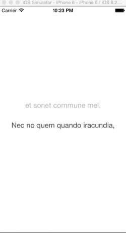

# VerticallyScrollingStatusView

A subclass of UIView that shows vertically scrolling status messages. The previous message scrolls up and fades when a new one is set.

For more information, check the screenshots or try the example project.

To run the example project, clone the repo, and run `pod install` from the Example directory first.

## Screenshot



## Usage

Usage is pretty simple!

```objective-c
self.statusView = [[VerticallyScrollingStatusView alloc] initWithFrame:CGRectMake(0, self.view.frame.size.height / 2, self.view.frame.size.width, 100.0f)];
[self.view addSubview:self.statusView];
```

Or if you use [PureLayout](https://github.com/smileyborg/PureLayout),

```objective-c
self.statusView = [VerticallyScrollingStatusView newAutoLayoutView];
[self.view addSubview:self.statusView];

[self.statusView autoCenterInSuperview];
[self.statusView autoMatchDimension:ALDimensionWidth toDimension:ALDimensionWidth ofView:self.view withOffset:-30.0f];
[self.statusView autoSetDimension:ALDimensionHeight toSize:100.0f];

```
And customize it!
```objective-c
[self.statusView setAnimationDuration:0.5f];
[self.statusView setFont:[UIFont systemFontOfSize:18.0]];
[self.statusView setTextColor:[UIColor blackColor]];
[self.statusView setNumberOfLines:2];

```

## Requirements

The only requirement is [PureLayout](https://github.com/smileyborg/PureLayout). However, if you're installing through CocoaPods, you don't have to worrk about that.

## Installation

VerticallyScrollingStatusView is available through [CocoaPods](http://cocoapods.org). To install
it, simply add the following line to your Podfile:

```ruby
pod "VerticallyScrollingStatusView"
```

## Author

Rahul Jiresal, rahul.jiresal@gmail.com, [website](http://www.rahuljiresal.com), [twitter](https://www.twitter.com/rahuljiresal)

Let me know if you like the pod, or have any suggestions. Any pull requests are welcome!

## License

VerticallyScrollingStatusView is available under the MIT license. See the LICENSE file for more info.
